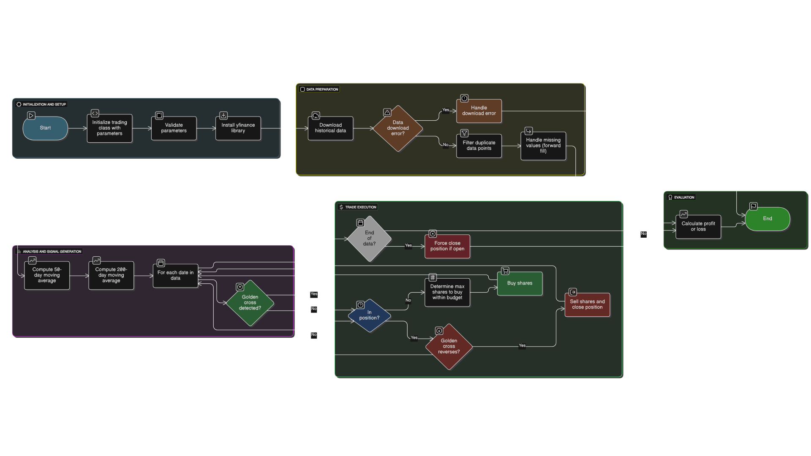

# Algorithmic Trading Adventure

Welcome to the **Algorithmic Trading Adventure** repository! This project explores algorithmic trading strategies using Python, focusing on the Golden Cross strategy.

## Golden Cross Strategy

The **Golden Cross strategy** monitors two moving averages:

- **Short-term moving average (MA50)**  
- **Long-term moving average (MA200)**  

A **buy signal** is generated when the short-term MA crosses above the long-term MA, aiming to capture upward trends.

### Flow Chart


## Project Structure 
Algorithmic-Trading-Adventure/
- **golden_cross.py**: Main script implementing the Golden Cross trading strategy.  
- **requirements.txt**: Python dependencies for the project.  
- **test_golden_cross.py**: Test suite to validate the Golden Cross strategy.  

## Installation

Clone the repository and install dependencies:

```bash
git clone https://github.com/mahabub-rah/Algorithmic-Trading-Adventure.git
cd Algorithmic-Trading-Adventure
pip install -r requirements.txt 

```
## Testing

Run the tests to ensure the strategy works correctly:
```bash 
pytest test_golden_cross.py
```